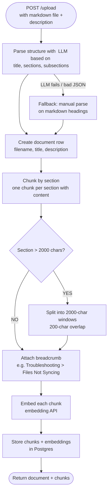
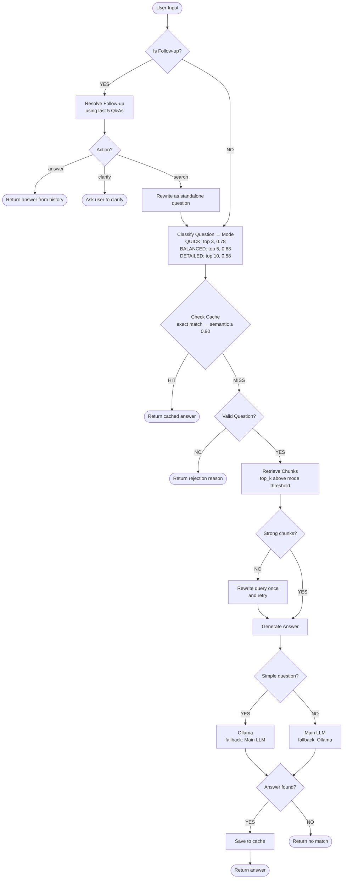
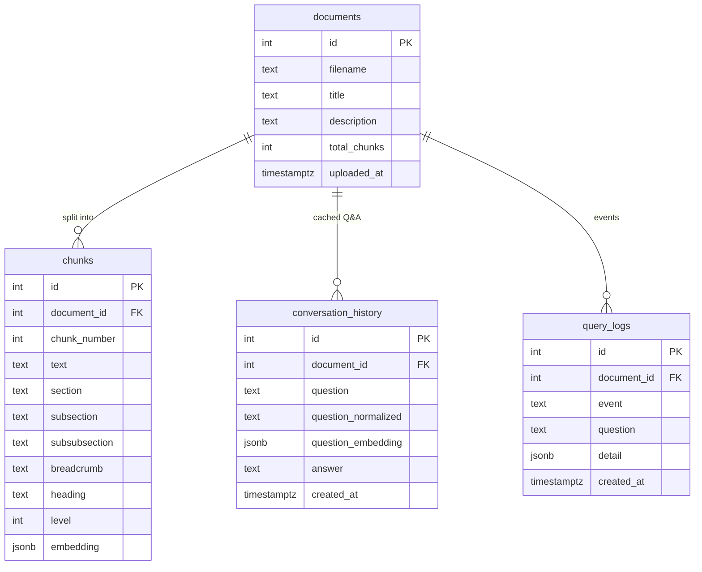

# Architecture

## Features

- Markdown upload with heading-based chunking and embeddings.An sample file is provided in the `docs` folder.
- Retrieval with cosine similarity, per-question-type thresholds, and  query rewrite
- Question validity check (rejects off-topic or keyword-only questions)
- Rule-based question classification (definition / how-to / comparison / troubleshooting / factual) that picks the retrieval mode
- Model routing: simple questions → Ollama first; everything else → main model with Ollama fallback
- Q&A cache (exact + semantic match)
- Follow-up handling ("tell me more") using the last 5 Q&As
- Query event logging with a `/metrics` endpoint
- Per-IP rate limiting (60 requests/minute, 1000/day) on the query endpoint

## Upload Flow

| Step | What happens |
|------|--------------|
| **Parse** | The Main LLM turns the Markdown into a section tree (title, headings, levels, content, children). If the request fails or the output isn't valid JSON, a regex parser splits on `#` headings instead |
| **Document row** | Stores filename, title (from the parse, or the filename), and the `description` used later by the question check |
| **Chunk by section** | Walks the section tree; every section with content becomes a chunk, keeping `section`, `subsection`, `subsubsection`, `heading`, and `level` |
| **Split large sections** | Sections over 2000 characters are split into 2000-character windows with 200-character overlap; a tiny leftover (< 200 chars) is merged into the previous chunk |
| **Breadcrumb** | Each chunk records its heading path (`Section > Subsection > ...`), shown to the LLM alongside the chunk text |
| **Embed** | Each chunk is embedded via the embedding API (`EMBEDDING_MODEL_NAME`). `POST /documents/{id}/embed` fills in any chunks that are missing embeddings |
| **Store** | Chunks and embeddings (JSONB) are saved to the `chunks` table, and `total_chunks` is updated on the document |

## Query Flow

Every step also logs an event to `query_logs`, which powers `/metrics`.

## Steps

| Step | What happens |
|------|--------------|
| **Is Follow-up?** | Regex check for phrases like "tell me more", "continue", "what about" |
| **Resolve Follow-up** | If there's no history, ask the user to clarify. Otherwise the LLM reads the last 5 Q&As and picks one of 3 actions: **answer** from history, **clarify** with the user, or **search** with a rewritten standalone question |
| **Classify Question** | Keyword rules decide the question type, which picks the retrieval mode and its thresholds |
| **Check Cache** | Exact match on the normalized question (lowercase, extra spaces collapsed) first, then semantic match on question embeddings (similarity ≥ 0.90; 0.85–0.90 is logged as a near miss) |
| **Valid Question?** | LLM checks the question is about the document and is a full question, not just keywords |
| **Retrieve Chunks** | Embed the question, score chunks by cosine similarity, keep up to `top_k` chunks above the mode's threshold |
| **Rewrite query** | If no chunk passes the threshold, the LLM rewrites the query once and retrieval runs again. If still nothing, the answer is "no match" |
| **Generate Answer** | Simple questions go to Ollama first; others go to the Main LLM first; each falls back to the other |
| **Save to cache** | Found answers are stored in `conversation_history` for future cache hits and follow-ups |

### Retrieval modes

| Question type | Mode | top_k | Threshold |
|---------------|------|-------|-----------|
| definition, factual | QUICK | 3 | 0.78 |
| how-to | BALANCED | 5 | 0.68 |
| comparison, troubleshooting | DETAILED | 10 | 0.58 |

### Models

| Name in diagram | Configured by |
|-----------------|---------------|
| Main LLM | `TEXT_MODEL_NAME` (any OpenAI-compatible chat model) |
| Ollama | `OLLAMA_MODEL` (local model) |

The follow-up resolution and query rewrite also use the Main LLM with Ollama as fallback.

## Data Model

| Table | Used by |
|-------|---------|
| `documents` | Upload, question check (`description`) |
| `chunks` | Retrieval (embeddings + breadcrumb + text) |
| `conversation_history` | Cache (exact on `question_normalized`, semantic on `question_embedding`) and follow-up resolution (last 5 rows) |
| `query_logs` | `/metrics` and `/metrics/logs` |

Deleting a document removes its chunks and cached Q&A; its logs are kept with `document_id` set to null.

## Limitations

This is a learning/portfolio project focused on understanding how a RAG system works end to end, so some production concerns are intentionally out of scope.

- **No frontend yet.** The main goal was the RAG pipeline itself; the API is used through Swagger (`/docs`) or `curl`.
- **Markdown only.** Chunking relies on Markdown headings. Other formats (PDF, DOCX, HTML) could be supported by converting them to Markdown before upload.
- **pgvector isn't used as expected yet.** Embeddings are stored as JSONB in Postgres and scored with cosine similarity in Python. This is fine for a few documents, but pgvector with an index would move the search into Postgres and scale much better.
- **Embedding search only.** There's no keyword (full-text/BM25) search alongside it, so exact terms like error codes or version numbers can be missed.
- **One document per query.** Questions can't span multiple documents.
- **Shared history per document.** Follow-ups use the last 5 Q&As for the document, not per user or session, so everyone querying the same document shares that context.
